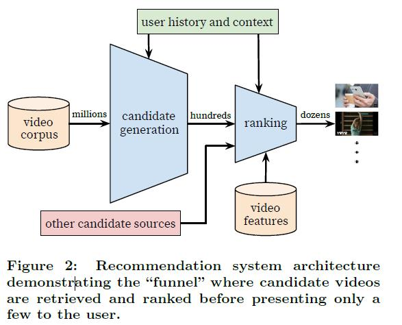

# Recommendation System Course Final Project
Final Project Paper Report in Recommendation System Course (Reichman University)
by Idan Kashtan

This repository includes my report on the paper: Deep Neural Networks for YouTube Recommendations
(2016) by Paul Covington, Jay Adams, Emre Sargin

1. The report document with my analysis and innovations (pdf)
2. One notebook with my implementation of their model and my innovation, testing on MovieLens 100K

## Results
Detailed results can be found in the report under:
* "Evaluation"

## Running the notebooks
* The notebook is already configured with the best default hyperparameters for the dataset.
* Hyperparameters values and full details can be found in the report under "Hyperparameter optimization and training"

### For the dataset
Inside the notebook, there is a section called "Getting data". From there, you can download the dataset. 
